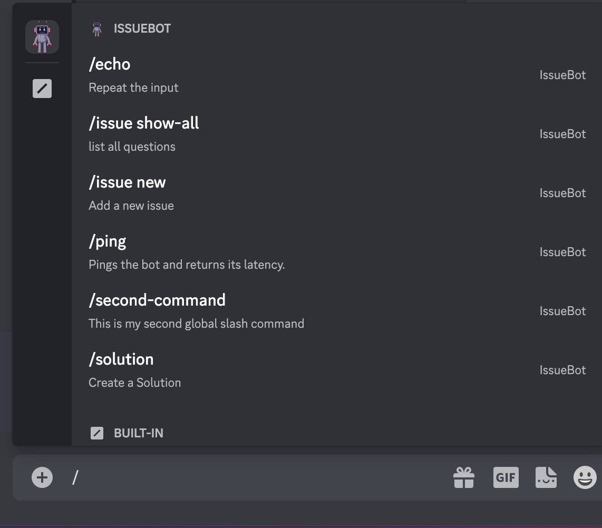

# _Discord Issue Bot_

#### By _Yodel Guanzon, Daniel Yakovlev, Brian Noh, Robert Onstott, & Teddy Atkinson_

#### _This Discord Issue Bot helps people organize and archive coding related questions and answers that they post to their Discord channels. It is primarily intended for the Discord servers of software development/coding schools, but could be used anywhere that people help each other learn. A Discord user can post to any channel in a server where Discord Issue Bot has been added, and if the user addresses their post to the Discord Issue Bot (using a slash "/" command), that post will also be exported to an external website where it will be archived and browsable. This effectively combines the real time convenience of a chat channel with the durability and organization of an external question and answer forum. Chat channels are instant but ephemeral, and Q&A forums are thorough but rigid-- Discord Issue Bot gives users the benefits of both... with a single post._

## Technologies Used

* _C# and .NET 6.0_
* _Discord.Net_
* _ASP.NET core MVC_
* _Entity Framework Core_
* _RestSharp_
* _NewtonSoft.Json_
* _SQL_
* _JQuery_
* _CSS_
* _Bootstrap_

## Description

_This application consists of 3 separate components: the Discord Bot itself, the external SQL database, and the MVC app that acts as the API client to that database. Working together, these 3 components allow a user to make a post to Discord, and later to go to a separate website/web app to view all the Issue and Solution posts that have ever been posted with Discord Issue Bot._
  _Discord Issue Bot is configured with the Discord.Net library for the ASP.NET web development framework. The bot sends and retrieves posts from an external database, which is configured with ASP.NET and Entity Framework Core. This database is configured for API calls, which is how it is accessed by the Discord Issue Bot web application (built with ASP.NET MVC)._
  _To run this software, you will have to host the servers locally on your machine, and in order to simulate the entire sequence of events from Discord posting to web app viewing, a total of 3 localhost servers are required._

## Setup/Installation Requirements

* _Download the .NET framework if you do not already have it (version 6.0 or later)_
 
  _https://dotnet.microsoft.com/en-us/download/dotnet_
  
* _Download MySQL Community Server and MySQL Workbench if you don't already have them (both from this link). Make note of both the `User ID (UID)` and the `Password (PWD)` that you define in your setup configurations for MySQL. These values will go into your `appsettings.json` file in a few steps_
  
    _https://dev.mysql.com/downloads/_
  
* _Clone this repository to your machine_

* _Open the repository and navigate to the `BackendApi` directory. Create a new file called `appsettings.json` in the root of the `BackendApi` directory. Copy the following code into the file, with your own values for `uid` and `pwd`._

```
  {
    "ConnectionStrings": {
        "DefaultConnection": "Server=localhost;Port=3306;database=discord_issue_bot;uid=[YOUR UID HERE];pwd=[YOUR PASSWORD HERE];"
      }
  }
```

* _While you are still in the `BackendApi` directory, enter the command `$dotnet ef database update` and then `$ dotnet run`. This will first create a local sql database with the schema mapped by EF Core, then it will start the server for the database. Leave the server running in this terminal._

* _Navigate to the `DiscordBotv2` directory, and create a new file called `appsettings.json`.  Your `token` will be generated by Discord when you register your bot, and you `guid` will be available when you create your server. Both things will happen next._ 
  
  ```
    {      
      "token": "[YOUR TOKEN HERE]",
      "guid": "[GUILD ID HERE]"
    }

  ```
* _If you don't already have a Discord account, create one now `https://discord.com/`._

* _Unless you already manage a Discord server, you will need to create a new Discord server (You have to have account manager privileges to add a bot to the server) `https://support.discord.com/hc/en-us/articles/204849977-How-do-I-create-a-server-`._

* _Go to the Discord server where you intend to add your Bot. Click the dropdown tab in the top left that has your server name. Click `Server Settings` then select `Widget`. Copy the `Server ID` and paste it into `appsettings.json` where it says `[GUILD ID HERE]`._
 
* _Now it is time to create your Discord Bot. Note: The next few steps of bot setup are described in more detail and with pictures at Discord.Net `https://discordnet.dev/guides/getting_started/first-bot.html`_  
   
   * _Go to the Discord Applications Portal `https://discord.com/developers/applications/` and click the `New Application` button. Give the application a name, then under `Settings` on the left click `Bot` and then `Add Bot`._
   * _You will be given an authorization `token` for your bot. Copy this token, and paste it into `appsettings.json` file were it says `[YOUR TOKEN HERE]`_   
   * _Now it is time to add the bot to your server. Click `Oath2` (under `Settings` on the left), tick `bot` under `scope`, choose the authorizations that you want to give the bot, and copy the authorization URL. Open this authorization URL in your browser, where you will be prompted to complete the setup and add it to a server._  

* _Leaving the `BackendApi` server running, open a new terminal. Navigate to `DiscordBotv2` and enter the command `$ dotnet run`. You must also leave this server running._

* _Finally, open a third terminal. Navigate to the `FrontEndClient` directory and enter the command `$ dotnet run`. Copy the URL `https://localhost:7016` and paste it into your browser. This will bring you to the external client-side web page for browsing all Issues and Solutions that have been posted via Discord Bot from your Discord Server_

## Using The Discord Issue Bot

* _To use the Discord Issue Bot, log into Discord and join the server where bot has been added. You should see that your bot is `ONLINE` (the bot will have whatever name you gave it). If the bot is not online, make sure that you have a terminal open and running the code in `DiscordBotv2`. If the bot is still not online, check the `appsettings.json` file and make sure that `token` and `guid` are properly entered. You may need to reset your token at the Discord Applications Portal `https://discord.com/developers/applications/`_

* _In the server, with Discord Issue Bot online , you can call the bot from any text channel or thread. To call the bot, type a slash "/" into the message line. A list of available commands will pop up, with the commands for your bot annotated with the bot's name:_



---------------------------------------------------------------

## API Endpoints
Base URL: `https://localhost:7210`

#### HTTP Request Structure
```
GET /api/{component}
POST /api/{component}
GET /api/{component}/{id}
PUT /api/{component}/{id}
DELETE /api/{component}/{id}
```

..........................................................................................

### Issues
Coding issues that have been posted by users from Discord via Discord Issue Bot

#### HTTP Request
```
GET /api/Issues
POST /api/Issues
GET /api/Issues/{id}
PUT /api/Issues/{id}
DELETE /api/Issues/{id}
```

#### Path Parameters
| Parameter | Type | Default | Required | Description |
| :---: | :---: | :---: | :---: | --- |
| searchTerm | string | none | false | Return matches by name or subject. Partial queries supported, so long as name or subject contains query |

#### Example Query
```
  https://localhost:7210/api/Issues?searchTerm=role'
```

#### Sample JSON Response
```

  {
    "issueId": 2,
    "token": null,
    "subject": "Discord.net how to mention roles",
    "name": null,
    "description": "How can I mention guild roles in C# with the Discord.net library?",
    "solutions": [
      {
        "solutionId": 2,
        "name": null,
        "description": "It's also possible to use the raw mention of a role, that is in fact the content of the .Mention property in a role object. The format is the following: <@&ROLE_ID> It differs from mentioning an individual user by the & character, that specifies it's mentioning the role, not a user. You can get the role ID from the .ID property, or by right clicking the role in the roles list, if you want to hardcode it. Example command of mentioning a role by the name:",
        "issueId": 2,
        "issue": null
      }
    ]
  }

```

..........................................................................................

### Solutions
Solutions posted in response to code Issues

#### HTTP Request
```
GET /api/Solutions
POST /api/Solutions
GET /api/Solutions/{id}
PUT /api/Solutions/{id}
DELETE /api/Solutions/{id}
```

#### Path Parameters
| Parameter | Type | Default | Required | Description |
| :---: | :---: | :---: | :---: | --- |
| none | -- | -- | -- | --

#### Example Query
```
'https://localhost:7210/api/Solutions/2'
```

#### Sample JSON Response
```
{
  "solutionId": 2,
  "name": null,
  "description": "It's also possible to use the raw mention of a role, that is in fact the content of the .Mention property in a role object. The format is the following: <@&ROLE_ID> It differs from mentioning an individual user by the & character, that specifies it's mentioning the role, not a user. You can get the role ID from the .ID property, or by right clicking the role in the roles list, if you want to hardcode it. Example command of mentioning a role by the name:",
  "issueId": 2,
  "issue": {
    "issueId": 2,
    "token": null,
    "subject": "Discord.net how to mention roles",
    "name": null,
    "description": "How can I mention guild roles in C# with the Discord.net library?",
    "solutions": [
      null
    ]
  }
}
  
```


## Known Bugs

* _No known bugs at this time_

## License

_MIT_

_Permission is hereby granted, free of charge, to any person obtaining a copy of this software and associated documentation files (the "Software"), to deal in the Software without restriction, including without limitation the rights to use, copy, modify, merge, publish, distribute, sublicense, and/or sell copies of the Software, and to permit persons to whom the Software is furnished to do so, subject to the following conditions:_

_The above copyright notice and this permission notice shall be included in all copies or substantial portions of the Software._

_THE SOFTWARE IS PROVIDED "AS IS", WITHOUT WARRANTY OF ANY KIND, EXPRESS OR IMPLIED, INCLUDING BUT NOT LIMITED TO THE WARRANTIES OF MERCHANTABILITY, FITNESS FOR A PARTICULAR PURPOSE AND NONINFRINGEMENT. IN NO EVENT SHALL THE AUTHORS OR COPYRIGHT HOLDERS BE LIABLE FOR ANY CLAIM, DAMAGES OR OTHER LIABILITY, WHETHER IN AN ACTION OF CONTRACT, TORT OR OTHERWISE, ARISING FROM, OUT OF OR IN CONNECTION WITH THE SOFTWARE OR THE USE OR OTHER DEALINGS IN THE SOFTWARE._

Copyright (c) January 2023_ _Yodel Guanzon, Daniel Yakovlev, Brian Noh, Robert Onstott, & Teddy Atkinson_
